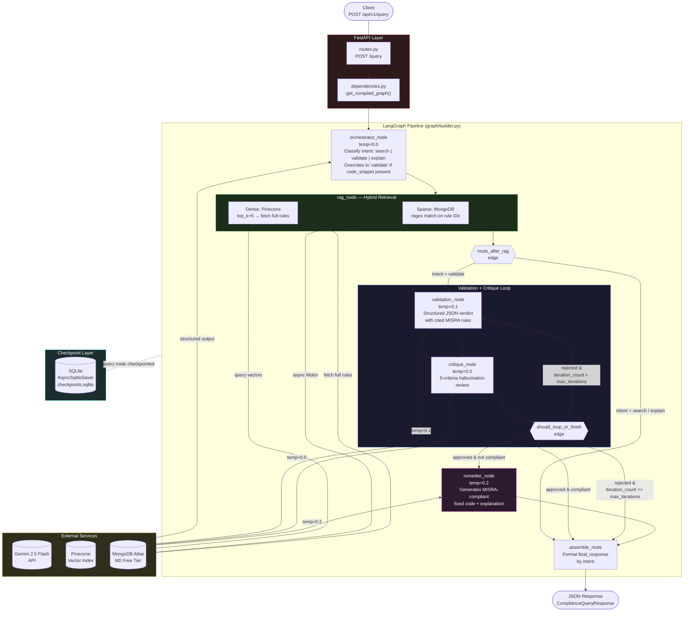

# MISRA C:2023 Compliance Validator

A production-quality **multi-agent system** that parses MISRA C:2023 technical standards, validates C code against them, and proposes remediated fixes. Built as a GitHub portfolio project demonstrating LLM orchestration, RAG pipelines, agentic critique loops, automated code remediation, and **async-first architecture with persistent state checkpointing**.

---

## Highlights

- **Fully asynchronous** end-to-end: every graph node, service call, and route handler is `async`. Even the synchronous Pinecone SDK is wrapped with `asyncio.to_thread()` to never block the event loop.
- **SQLite checkpoint memory** via LangGraph's `AsyncSqliteSaver` + `aiosqlite` — every node execution is durably persisted, enabling session resumption and time-travel replay.
- **Granular Session Resumption** — clients can pass a `thread_id` to continue a previous session, or omit it to start fresh. Every response returns the `thread_id` for future reference.
- **"Time Travel" debugging** via the `/replay` endpoint — fork and re-execute from any checkpoint in a session's history, essential for verifying complex MISRA C compliance logic where multiple agents (Orchestrator, RAG, Validator, Critique) interact across iterations.

---

## Tech Stack

| Layer | Technology |
|---|---|
| API | FastAPI + Uvicorn |
| LLM | Google Gemini 2.5 Flash (`langchain-google-genai`) |
| Embeddings | `gemini-embedding-001` (768 dims) |
| Vector DB | Pinecone (free tier, serverless, cosine) |
| Document DB | MongoDB Atlas M0 (free) via Motor (async) |
| Checkpoint DB | SQLite via `aiosqlite` + `AsyncSqliteSaver` |
| Agent framework | LangGraph + LangChain Core |
| Config | Pydantic Settings + `python-dotenv` |
| Logging | `structlog` (structured, console renderer) |
| Language | Python 3.11+ |

---

## Architecture



---

## Project Structure

```
MyProjectCv/
├── main.py                              # FastAPI app factory + lifespan (SQLite checkpoint)
├── requirements.txt
├── pytest.ini
├── checkpoints.sqlite                   # Runtime-generated checkpoint DB (gitignored)
│
├── app/
│   ├── config.py                        # Pydantic Settings (lru_cache), CORS origins
│   ├── utils.py                         # parse_json_response(), calculate_gemini_cost(), structlog
│   ├── models_pricing.py                # Gemini model pricing table (30+ models)
│   │
│   ├── models/
│   │   ├── state.py                     # ComplianceState TypedDict (with token tracking)
│   │   ├── requests.py                  # ComplianceQueryRequest (with thread_id), IngestRuleRequest
│   │   └── responses.py                 # ComplianceQueryResponse, ThreadHistory*, MetadataUsage
│   │
│   ├── graph/
│   │   ├── builder.py                   # build_graph() with AsyncSqliteSaver + assemble_node
│   │   ├── edges.py                     # route_after_rag, should_loop_or_finish
│   │   └── nodes/
│   │       ├── orchestrator.py          # Intent classifier (async, structured output)
│   │       ├── rag.py                   # Hybrid retrieval (async)
│   │       ├── validation.py            # MISRA compliance checker (async, structured output)
│   │       ├── critique.py              # Hallucination reviewer (async, structured output)
│   │       └── remedier.py              # Code remediation (async, structured output)
│   │
│   ├── services/
│   │   ├── llm_service.py              # get_llm(), get_structured_llm() wrappers
│   │   ├── embedding_service.py         # Singleton, async embed + store
│   │   ├── pinecone_service.py          # Auto-creates index, query/upsert via asyncio.to_thread
│   │   └── mongodb_service.py           # Async Motor CRUD + indexes
│   │
│   ├── api/
│   │   ├── routes.py                    # /health, /query, /seed, /replay, /history
│   │   └── dependencies.py             # get_compiled_graph (from app.state), DB deps
│   │
│   └── data/
│       └── ingest.py                    # MISRA parser → MongoDB + Pinecone ingestion
│
├── data/
│   └── misra_c_2023__headlines_for_cppcheck.txt
│
└── tests/
    ├── conftest.py                      # Session-wide settings override with dummy keys
    └── unit/
        ├── graph/
        │   ├── test_builder.py
        │   ├── test_edges.py
        │   └── nodes/
        │       ├── test_rag.py
        │       ├── test_orchestrator.py
        │       ├── test_validation.py
        │       ├── test_critique.py
        │       └── test_remedier.py
        ├── services/
        │   └── test_mongodb_service.py
        └── utils/
            └── test_utils.py
```

---

## API Endpoints

| Method | Path | Description |
|---|---|---|
| `GET` | `/api/v1/health` | Pings MongoDB and Pinecone; returns `healthy` or `degraded` |
| `POST` | `/api/v1/query` | Runs the full LangGraph multi-agent pipeline |
| `POST` | `/api/v1/seed` | Parses MISRA txt file and ingests into MongoDB + Pinecone |
| `POST` | `/api/v1/replay/{thread_id}/{checkpoint_id}` | Re-executes the graph from a specific checkpoint (Time Travel) |
| `GET` | `/api/v1/history/{thread_id}` | Returns all checkpoint snapshots for a session |

### Example: Validate a code snippet

```json
{
  "query": "Does this code handle memory allocation safely?",
  "code_snippet": "char *p = malloc(n);",
  "standard": "MISRA C:2023"
}
```

### Example: Resume a previous session

```json
{
  "query": "What about the pointer arithmetic in line 12?",
  "thread_id": "abc123-previous-session-id",
  "standard": "MISRA C:2023"
}
```

Pass a `thread_id` from a previous response to continue the same session. Omit it to start a new session (a UUID is auto-generated).

### Example: Ask a question (no code snippet)

```json
{
  "query": "What does MISRA C:2023 say about pointer arithmetic?",
  "standard": "MISRA C:2023"
}
```

When no `code_snippet` is provided, the orchestrator classifies the intent as `search` or `explain` and returns relevant rules directly — skipping validation, critique, and remediation entirely.

### Example Query Response (non-compliant code)

```json
{
  "intent": "validate",
  "thread_id": "550e8400-e29b-41d4-a716-446655440000",
  "final_response": "Validation Complete.\nStandard: MISRA C:2023\nCompliant: false\n...",
  "is_compliant": false,
  "confidence_score": 0.92,
  "cited_rules": ["MISRA_21.3"],
  "critique_iterations": 1,
  "critique_passed": true,
  "fixed_code_snippet": "void *p = malloc(n);\nif (p == NULL) { /* handle error */ }",
  "remediation_explanation": "Rule 21.3 (Required): malloc return value was not checked for NULL → added NULL check to handle allocation failure.",
  "total_tokens_usage": {
    "prompt_tokens": 1240,
    "completion_tokens": 380,
    "total_tokens": 1620,
    "estimated_cost": 0.000021
  }
}
```

---

## SQLite Checkpoint Memory

Every node execution in the LangGraph pipeline is automatically persisted to a local `checkpoints.sqlite` database via LangGraph's `AsyncSqliteSaver`. This provides:

- **Durable state** — the full `ComplianceState` (query, retrieved rules, validation results, critique feedback, token counts) is saved after each node completes.
- **Session continuity** — clients resume conversations by re-using a `thread_id`. The graph picks up exactly where it left off.
- **Crash recovery** — if the server restarts mid-pipeline, the checkpoint allows resumption from the last completed node rather than re-running from scratch.

The SQLite connection is managed via FastAPI's `lifespan` context manager in `main.py`: opened on startup, passed into `build_graph()`, and closed cleanly on shutdown.

---

## Granular Session Resumption

The API supports **granular session resumption** through `thread_id` tracking:

1. **Start a session** — `POST /query` without a `thread_id`. The server generates a UUID and returns it in the response.
2. **Continue a session** — `POST /query` with the same `thread_id`. LangGraph loads the checkpointed state and continues from where it left off.
3. **Inspect a session** — `GET /history/{thread_id}` returns the full checkpoint timeline: every node that executed, the state at each point, and the `checkpoint_id` for each snapshot.

---

## Time Travel Debugging with `/replay`

The `POST /replay/{thread_id}/{checkpoint_id}` endpoint enables **"Time Travel" debugging** — the ability to fork from any past checkpoint and re-execute the graph from that point forward.

This is essential for verifying complex MISRA C compliance logic where multiple agents (Orchestrator, RAG, Validator, Critique) interact across iterations:

- **Reproduce critique loops** — replay from a specific validation checkpoint to observe how the Critique agent evaluates the same evidence a second time.
- **Debug non-determinism** — re-run from the same state to see if the Validator produces consistent verdicts across executions.
- **Inspect branching decisions** — fork from just before `route_after_rag` or `should_loop_or_finish` to verify routing logic with the actual intermediate state.
- **Audit compliance verdicts** — given the safety-critical nature of MISRA C, Time Travel lets you replay the exact sequence of agent decisions that led to a compliance / non-compliance ruling.

### Workflow

```bash
# 1. Run a query
curl -X POST http://localhost:8000/api/v1/query \
  -H "Content-Type: application/json" \
  -d '{"query": "Is this safe?", "code_snippet": "char *p = malloc(n);"}'
# → returns thread_id: "abc123"

# 2. Inspect the checkpoint timeline
curl http://localhost:8000/api/v1/history/abc123
# → returns ordered list of checkpoints with IDs

# 3. Replay from a specific checkpoint
curl -X POST http://localhost:8000/api/v1/replay/abc123/checkpoint_xyz
# → re-executes from that point, returns fresh ComplianceQueryResponse
```

---

## Async Architecture

The entire pipeline is asynchronous:

| Component | Pattern |
|---|---|
| Route handlers | `async def` with `await graph.ainvoke()` |
| Graph nodes (orchestrator, rag, validation, critique, remedier) | `async def` with `await llm.ainvoke()` |
| MongoDB service | `motor.AsyncIOMotorClient` (native async) |
| Pinecone service | Sync SDK wrapped in `asyncio.to_thread()` |
| Embedding service | `aembed_query()` / `aembed_documents()` |
| SQLite checkpoint | `aiosqlite` + `AsyncSqliteSaver` |
| Assemble node | Synchronous (pure string formatting, no I/O) |

---

## Setup

### 1. Clone and install

```bash
git clone https://github.com/<your-username>/MyProjectCv.git
cd MyProjectCv
pip install -r requirements.txt
```

### 2. Configure environment

```bash
cp .env.example .env
```

Edit `.env` with your credentials:

```env
# Required
GEMINI_API_KEY=your_key_here
PINECONE_API_KEY=your_key_here
MONGODB_URI=mongodb+srv://...

# Optional (defaults shown)
GEMINI_MODEL=gemini-2.5-flash
GEMINI_EMBEDDING_MODEL=gemini-embedding-001
PINECONE_INDEX_NAME=compliance-rules
PINECONE_CLOUD=aws
PINECONE_REGION=us-east-1
MONGODB_DATABASE=compliance_db
MONGODB_COLLECTION=rules
```

### 3. Start the server

```bash
uvicorn main:app --reload
```

### 4. Seed the knowledge base (run once)

```bash
curl -X POST http://localhost:8000/api/v1/seed
```

### 5. Health check

```bash
curl http://localhost:8000/api/v1/health
```

Swagger UI is available at `http://localhost:8000/docs`.

---

## Agent Pipeline Detail

### Orchestrator Node (`temp=0.0`)
Classifies the user's intent as `search`, `validate`, or `explain`. If a `code_snippet` is present in the request, intent is always overridden to `validate`. Outputs a structured `OrchestratorOutput` Pydantic object and hardcodes `standard="MISRA C:2023"`.

### RAG Node — Hybrid Retrieval
Combines two retrieval strategies:
- **Sparse (MongoDB):** regex match against rule IDs found in the query text
- **Dense (Pinecone):** semantic vector search `top_k=5`, filtered by `{"scope": "MISRA C:2023"}`, then full rule text is fetched from MongoDB using the vector IDs

### Validation Node (`temp=0.1`)
Checks C code against the retrieved MISRA rules. Returns a structured JSON verdict with `is_compliant`, `confidence_score`, and `cited_rules`. Handles `critique_feedback` from the critique node on re-runs.

### Critique Node (`temp=0.0`)
Reviews the validation output against 5 hallucination criteria. Returns `critique_approved` (bool) and `critique_feedback`. If rejected and `iteration_count < max_iterations` (default: 4), the graph loops back to the validation node.

### Remediation Node (`temp=0.2`)
Triggered only when `critique_approved=True` and `is_compliant=False`. Takes the original non-compliant code, the cited rules (with full rule text), and the validation report, then generates a minimally-modified compliant version. Respects MISRA rule categories (Mandatory / Required / Advisory) and outputs both `fixed_code_snippet` and a per-rule `remediation_explanation`.

### Assemble Node
Formats `final_response` based on the resolved intent. Defined inline in `graph/builder.py`.

---

## Token Tracking and Cost Estimation

Every LLM-calling node tracks `prompt_tokens`, `completion_tokens`, and `total_tokens`. These counters use `Annotated[int, operator.add]` in `ComplianceState`, so they accumulate automatically across nodes via LangGraph's state reducer.

The response includes a `total_tokens_usage` object with per-node breakdowns and an `estimated_cost` computed from Gemini's pricing table (`app/models_pricing.py`).

---

## Running Tests

```bash
pytest tests/ -v --cov
```

Tests mock all external services (Gemini, Pinecone, MongoDB) via `conftest.py` and `pytest-mock`. No API keys are needed to run the test suite.

---

## License

[Apache 2.0](LICENSE)
